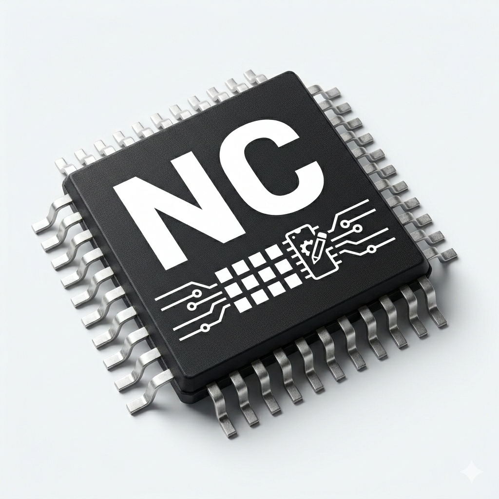

<p align="center">
  
</p>

# NC ROM Editor

[](https://github.com/cdufresne81/NCRomEditor)

> **Notice:** This project was built with AI assistance (vibe coded). Modifying and flashing ECU software carries real risk — incorrect tunes can damage your engine, ECU, or other vehicle components. The author assumes no responsibility for any damage to your vehicle, hardware, or any other consequence arising from the use of this software. **Use entirely at your own risk.** Always keep backups of your stock ROM and understand what you are changing before flashing.

An open-source ROM editor for NC Miata (MX-5) ECUs, designed to replace the discontinued EcuFlash for ROM editing tasks.

## Overview

NC ROM Editor is a desktop application that allows you to read, edit, and save ECU ROM files for NC generation Mazda MX-5 Miata vehicles. This tool focuses solely on ROM file manipulation and works in conjunction with RomDrop for actual ECU flashing.

## Installation

Download the latest release for your platform from [GitHub Releases](https://github.com/cdufresne81/NCRomEditor/releases).

### Windows
Download the `.exe` installer and run it.

> **Note:** The installer is not code-signed, so Windows SmartScreen may show an "Unknown publisher" warning. Click **"More info"** then **"Run anyway"** to proceed. This is normal for open-source software without a paid signing certificate.

### Linux
Download the `.tar.gz` archive, extract it, and run the `NCRomEditor` binary:
```bash
tar -xzf NCRomEditor-*-linux-x86_64.tar.gz
cd NCRomEditor
./NCRomEditor
```

### Clone the Repository
```bash
git clone https://github.com/cdufresne81/NCRomEditor.git
cd NCRomEditor
```

## Run from Source

### Windows
Simply double-click `run.bat` or see [Windows Setup Guide](docs/WINDOWS_SETUP.md) for details.

### Linux/macOS
```bash
python3 -m venv venv
source venv/bin/activate
pip install -r requirements.txt
python main.py
```

### Verify Installation
1. Run the application
2. File → Open → Select `examples/lf9veb.bin`
3. Browse tables in the left panel
4. Click any table to view data

## Features

### Core Features
- Automatic ROM ID detection and XML definition matching
- Read NC Miata ECU ROM binary files
- View 1D, 2D, and 3D tables with proper axis labels
- Save modified ROM files
- ROM ID verification

### Table Browser
- Browse tables organized by category
- Search tables by category, name or address 
- Show only modified tables.

### Table Editing
- Direct cell value editing with validation
- Undo/redo support (`Ctrl+Z`/`Ctrl+Y`)
- Add/Subtract values to selected cells
- Multiply selected cells by a factor
- Set all selected cells to a specific value
- Increment/Decrement values (`+`/`-` keys)
- Smoothing filter for selected cells (`S` key)
- Vertical interpolation (`V` key)
- Horizontal interpolation (`H` key)
- 2D bilinear interpolation for 3D tables (`B` key)

### Table Clipboard & Export
- Copy/paste cells (`Ctrl+C`/`Ctrl+V`)
- Copy entire table to clipboard for Excel (`Ctrl+Shift+C`)
- Export table to CSV (`Ctrl+E`)

### Table Visualization
- Interactive 3D surface plot for 3D tables
- 2D line graph for 2D tables
- Toggle graph panel (`G` key)
- Cell selection highlighting on graph
- Configurable color maps

### ECU Flashing
- One-click flash via RomDrop integration (`Ctrl+Shift+F`)
- Safety warning dialog with pre-flash checklist (dynamic flash mode only)
- Auto-saves unsaved changes before flashing
- Configurable RomDrop executable path in Settings → Tools

### ROM Comparison
- Side-by-side comparison of two ROMs (`Ctrl+Shift+D`)
- Category tree listing all modified tables with change counts
- Changed cells highlighted with gray border (matching edit indicators)
- "Changed only" toggle dims unchanged cells for focus
- Synchronized scrolling between original and modified panels
- Keyboard navigation: `↑`/`↓` tables, `T` toggle, `Esc` close

### User Interface
- Multi-ROM support with tabs
- Per-ROM color swatches on tabs to easily identify which ROM is which when multiple files are open
- Multi-window table viewers
- Recent files list
- Session restoration (automatically reopen last ROM)
- Configurable settings (font size, color maps)
- Verbose activity log console
- Keyboard shortcuts for all major operations
- Cross-platform: Windows, Linux, and macOS

### AI Assistant Integration (MCP)
- Built-in MCP server for AI assistants (Claude, ChatGPT, Gemini)
- Start/stop from the app via Tools menu or toolbar
- Auto-discovery of open ROMs — AI can see what you're working on
- 9 tools: read-only inspection (ROM info, list/read/compare tables, statistics) plus live read/write through the app with full undo support
- Works with Claude Code (`.mcp.json`) and Claude Desktop (`claude_desktop_config.json`)
- Optional auto-start on app launch (Settings > Tools)

### In Development
- Projects management

## Keyboard Shortcuts

| Shortcut | Action |
|----------|--------|
| `Ctrl+Z` | Undo |
| `Ctrl+Y` | Redo |
| `Ctrl+C` | Copy selected cells |
| `Ctrl+V` | Paste |
| `Ctrl+Shift+C` | Copy table to clipboard |
| `Ctrl+E` | Export to CSV |
| `+` | Increment selected cells |
| `-` | Decrement selected cells |
| `V` | Vertical interpolation |
| `H` | Horizontal interpolation |
| `B` | Bilinear interpolation |
| `S` | Smooth selection |
| `G` | Toggle graph panel |
| `Ctrl+O` | Open ROM file |
| `Ctrl+Shift+D` | Compare open ROMs |
| `Ctrl+Shift+F` | Flash ROM to ECU via RomDrop |

## Tech Stack

- **Python 3.12+**
- **PySide6** - Qt6 bindings for Python (GUI framework)
- **NumPy** - Numerical operations on table data
- **Matplotlib** - 3D/2D visualization of maps

## Project Structure

```
nc-rom-editor/
├── src/
│   ├── core/                          # ROM parsing & binary reading
│   │   ├── rom_definition.py          # Data structures for tables
│   │   ├── definition_parser.py       # XML parser for ROM definitions
│   │   ├── rom_reader.py              # Binary ROM reader/writer
│   │   ├── rom_detector.py            # Automatic ROM ID detection
│   │   ├── change_tracker.py          # Undo/redo system
│   │   ├── project_manager.py         # Project creation/loading
│   │   └── version_models.py          # Commit and version data structures
│   ├── ui/                            # Qt GUI widgets
│   │   ├── table_viewer_window.py     # Main table viewer window
│   │   ├── table_viewer.py            # Table grid widget
│   │   ├── table_viewer_helpers/      # Modular helper classes
│   │   │   ├── display.py             # Rendering and formatting
│   │   │   ├── editing.py             # Cell editing logic
│   │   │   ├── operations.py          # Bulk operations
│   │   │   ├── interpolation.py       # Interpolation algorithms
│   │   │   └── clipboard.py           # Copy/paste and export
│   │   ├── compare_window.py          # ROM comparison window
│   │   ├── graph_viewer.py            # 3D/2D graph visualization
│   │   ├── table_browser.py           # Category tree browser
│   │   ├── history_viewer.py          # Version history viewer
│   │   ├── project_wizard.py          # Project creation dialog
│   │   └── settings_dialog.py         # Settings/preferences
│   ├── api/                           # Command API (HTTP bridge for MCP)
│   │   └── command_server.py          # HTTP server bridging to Qt thread
│   ├── mcp/                           # MCP server for AI assistants
│   │   ├── server.py                  # FastMCP server (STDIO + SSE)
│   │   └── rom_context.py            # ROM loading, caching, tool logic
│   └── utils/                         # Helper functions
│       ├── settings.py                # Settings manager
│       └── colormap.py                # Color scheme utilities
├── examples/                          # Example ROM files
│   ├── metadata/                      # ROM metadata XML files
│   │   └── lf9veb.xml                 # NC Miata ROM definition (511 tables)
│   └── lf9veb.bin                     # Stock NC Miata ROM binary
├── packaging/                         # Build & installer scripts
│   ├── build.bat                      # Windows build script
│   ├── installer.iss                  # Inno Setup installer script
│   ├── NCRomEditor.spec              # PyInstaller spec
│   └── requirements-build.txt        # Build-only dependencies
├── docs/                              # Documentation
│   ├── ROM_DEFINITION_FORMAT.md
│   └── WINDOWS_SETUP.md              # Windows setup guide
├── main.py                            # Application entry point
├── run.bat                            # Windows launcher
└── run.sh                             # Linux launcher
```

## Usage

1. **Load ROM:** File → Open → Select `examples/lf9veb.bin`
2. **Browse Tables:** Expand categories in the left panel (e.g., "Spark Target - Base")
3. **View Table:** Click any table to see its data with axis values
4. **Edit Values:** Click cells to edit, use shortcuts for bulk operations
5. **Visualize:** Press `G` to toggle 3D/2D graph view
6. **Save ROM:** File → Save ROM or Save ROM As...
7. **Flash to ECU:** Tools → Flash ROM to ECU (or `Ctrl+Shift+F`) — launches RomDrop with your ROM file

### Using Projects

Projects provide version control for your tuning work. Every commit creates a named, flashable ROM snapshot and an auto-generated tuning log.

1. **Create Project:** File → New Project → Select a ROM file
2. **Make Changes:** Edit tables, Ctrl+S saves to the working ROM
3. **Commit:** File → Commit Changes → Name the version (e.g., "egr_delete") → a snapshot and log entry are created
4. **View History:** View → Commit History to browse all versions
5. **Revert:** Select a version in History → "Revert to this version" to restore it
6. **Delete:** Remove bad versions — snapshots are moved to `_trash/`

## Development

### Running Tests

The project uses pytest for testing. All tests are located in the `tests/` directory.

**Run all tests:**
```bash
# Activate virtual environment first
source venv/bin/activate  # Linux/macOS
# or
venv\Scripts\activate  # Windows

# Run tests
pytest

# Run with coverage report
pytest --cov=src --cov-report=html

# Run specific test file
pytest tests/test_rom_detector.py

# Run tests matching a pattern
pytest -k "test_rom_id"
```

**Test Coverage:**
- Core modules (parser, detector, reader): 86-96%
- Overall: 70%

View detailed coverage report: `htmlcov/index.html`

### Code Quality

**Format code with black:**
```bash
black src/ tests/
```

**Lint code with flake8:**
```bash
flake8 src/ tests/
```

### CI/CD

Tests run automatically on GitHub Actions for:
- Python 3.10, 3.11, 3.12
- Ubuntu, Windows, macOS

## Development Status

**Current Version:** v1.5.0

This version includes full table editing, project management with version history, interactive graph visualization, ROM comparison tool, a polished toolbar-driven UI, and AI assistant integration via MCP server.

**Next Priorities:**
- Project management

## Contributing

Contributions welcome! This is an open-source project to preserve and improve upon the functionality of the discontinued EcuFlash tool.

## License

This project is licensed under the [GNU General Public License v3.0](LICENSE).

